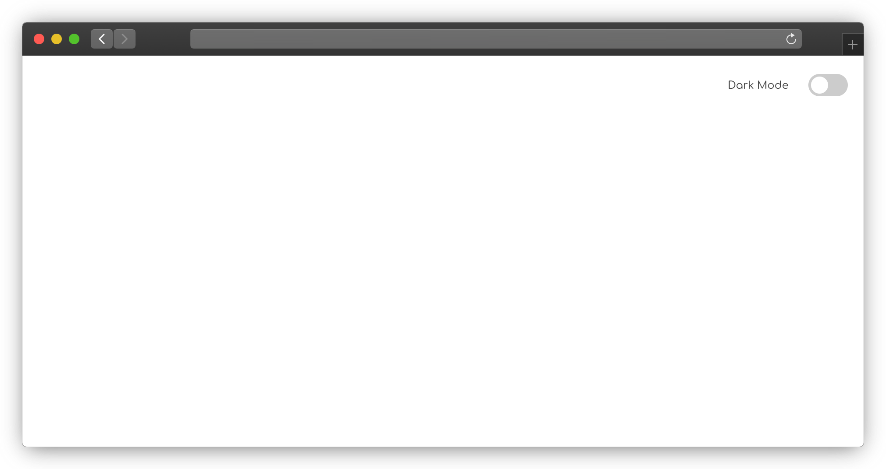
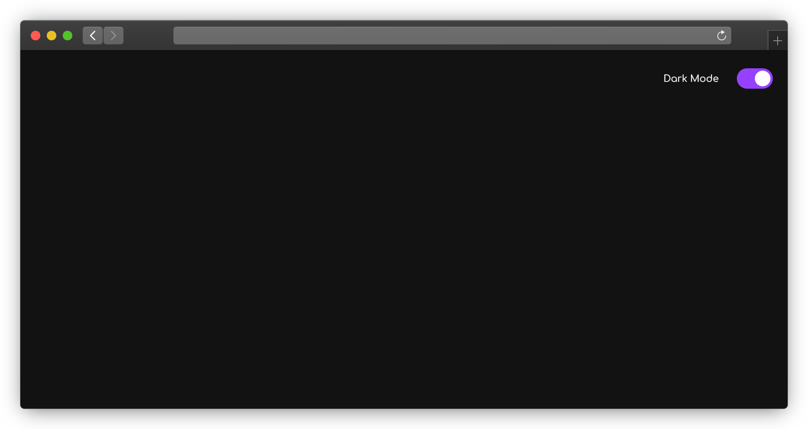

# Dark Mode Toggle Template

A repo with a basic JavaScript and CSS to turn a simple website/ Static page into both dark and light mode.

## Usage

- Open up the `style.css` file and change the Light and dark theme `vars` according to your preference.
- If you want to play a little bit with `script.js` file content according to _HTML-file content_
- Add your HTML content and your website is good to go.

## Live Demo

- https://captainwaheed.github.io/Dark-mode-toggle/

### Prerequisites

The things you need before installing the website source code.

- You need to have basic knowledge of HTML and CSS syntax.
- And you need to have understanding of JavaScript animation library.
- Oh, and don't forget to have VScode installed (you can use other editors as well)

## Built with

- 
- 
- 
- 

## Feedback

If you have any query, please reach me at : abdulwaheed@ieee.org

## 🔗 Links

